
<h1 align="center">基于的线上选课系统的设计与实现+jsp</h1>

## 简介
线上选课系统：角色分为管理员、班主任、学生；功能包括选课管理、课程管理、学生管理、留言管理、公告管理和院系管理。    --计算机毕业设计源码；毕设源码；java毕业设计源码

## 联系方式

<h3 align="center">获取完整代码与数据库文件 + 微信：deepguan QQ: 86050149 QQ群: 783742310</h3>

<h3 align="center">可帮忙远程部署 包运行成功！提供远程部署、修改代码、设计文档指导、代码讲解等服务！</h3>

## 功能介绍（完整见运行截图）
管理员：管理员可以通过导航栏管理公告和课程，进行院系和班主任信息的编辑和管理，支持班主任信息的查询、查看、修改、删除和密码重置。此外，管理员可以管理留言板留言，并查看、回复和删除留言。通过添加或更新课程信息，管理员可以上传课程图片，设置上课时间、地点和人数，并提供课程管理和公告管理的功能。

班主任：班主任可以登录到个人中心，使用导航菜单操作如课程、学生和班级信息的管理。搜索框支持班主任的账户、姓名、手机号码等信息查询，班主任可以查看和编辑个人资料及所管理班级的信息，并通过操作按钮进行修改和删除班级相关信息。

学生：学生可以注册、登录和访问导航栏中的功能模块，通过首页查看课程和公告信息。学生可通过输入框搜索课程编号、名称和类型，选择课程并查看课程详情和信息。此外，学生可进入个人中心修改个人资料，查看已选课程、公告与课程留言，并通过留言功能与教师进行沟通。

课程管理员：课程管理员负责添加、更新和管理课程，包括上传课程图片、选择课程类型、填写简介和设置上课时间和地点。课程管理员通过课程管理界面操作，可以查看课程选择情况、调整课程信息，以及管理课程成绩的记录与发布。课程管理员还可通过筛选条件在系统中查询具体课程信息。

## 运行截图
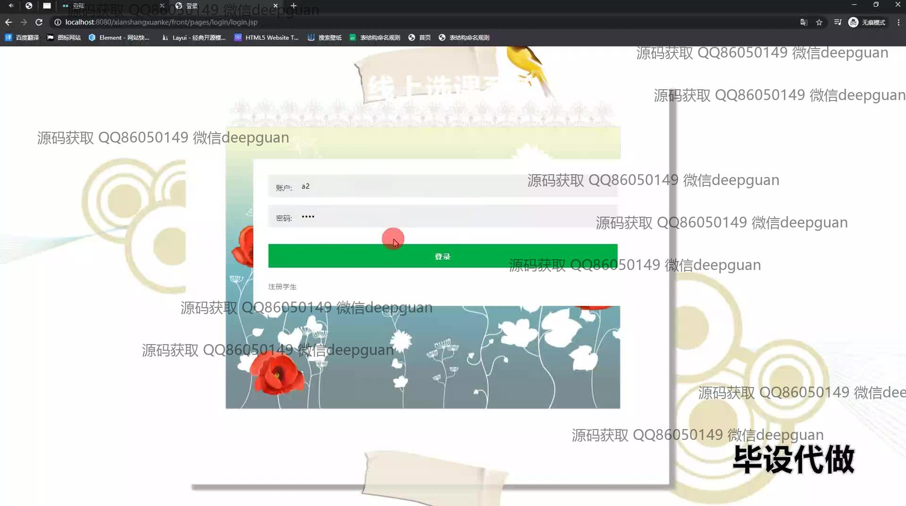
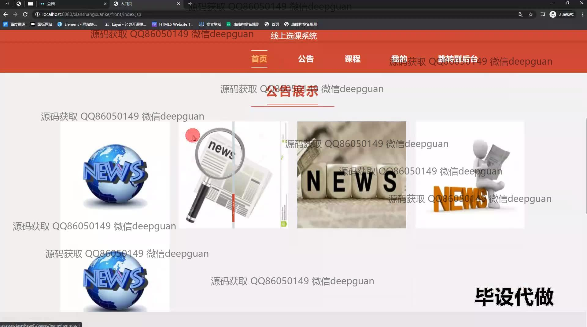

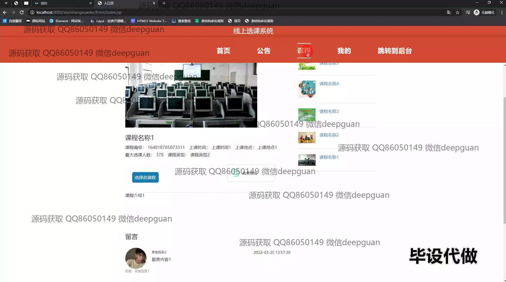
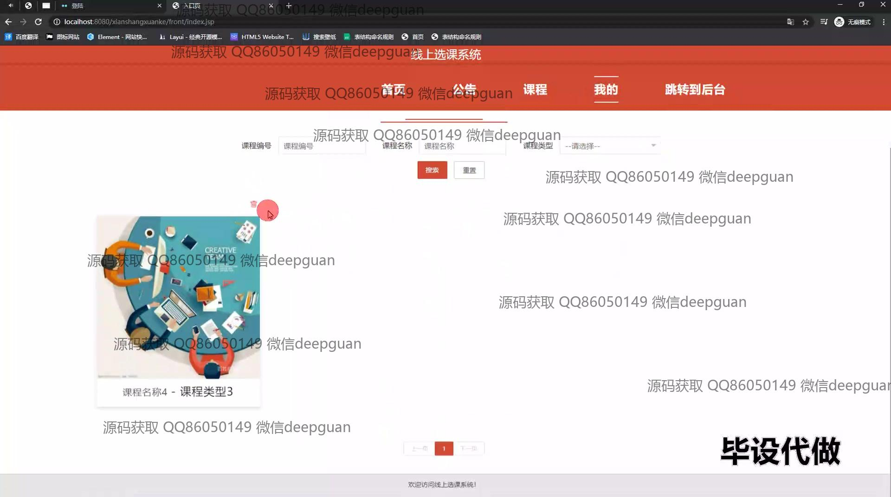
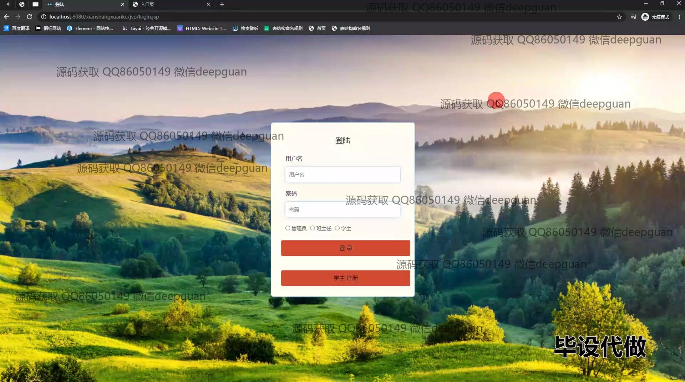
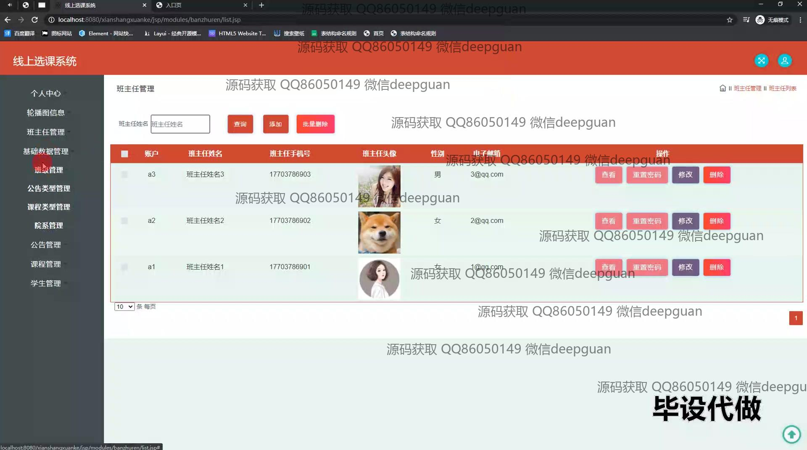
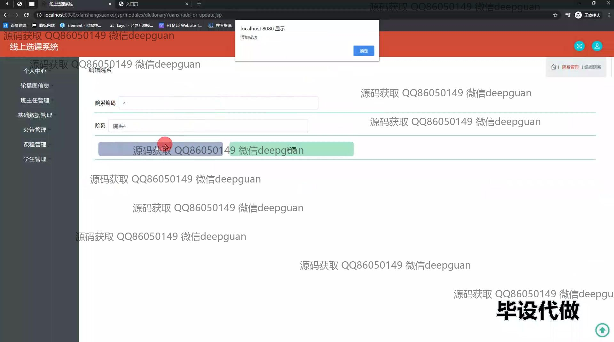
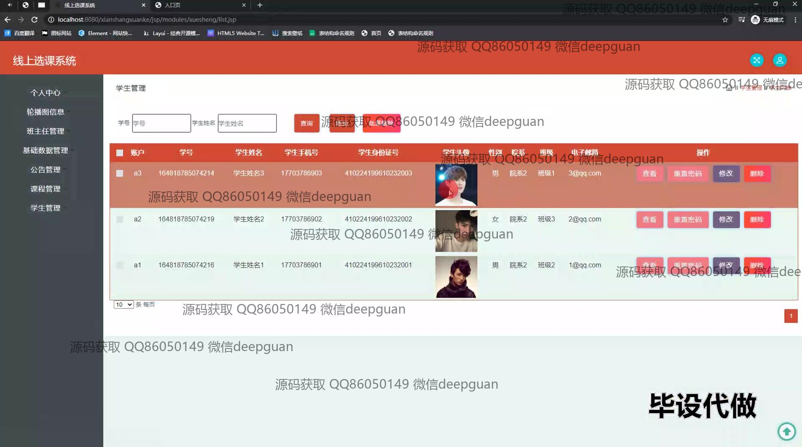
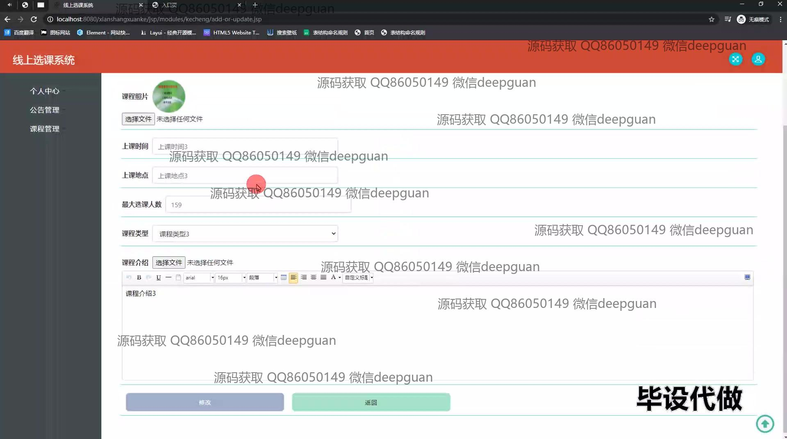
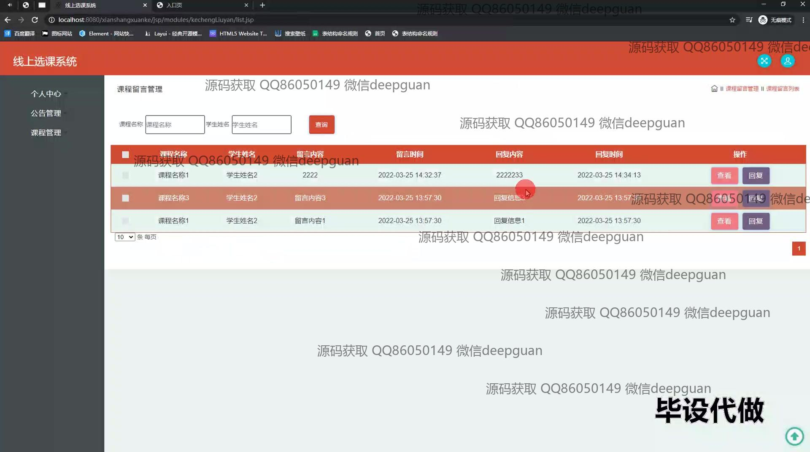
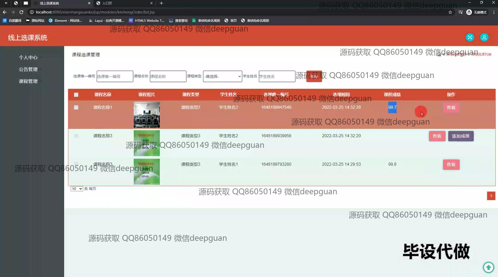

本代码来源于网络,仅供学习参考使用!

